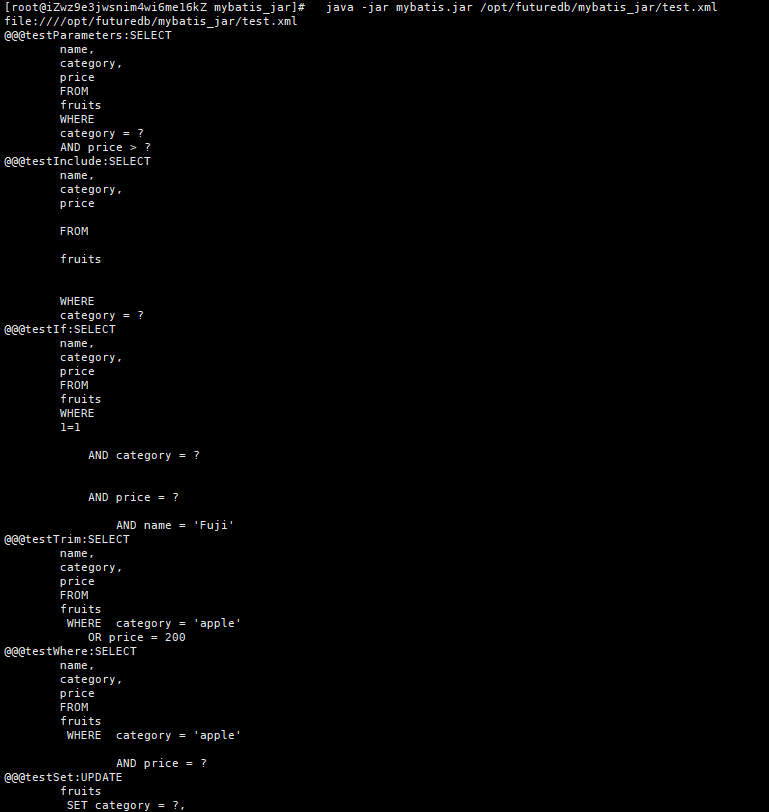

mybatis2sql 基于mybatis-3.5.4定制支持静态分析XML文件输出SQL指纹。

原生的mybatis必须传参数，动态构造对象，传入mybatis API生成SQL，本项目绕开这个限制，直接分析mybatis XML文件。

## XML
#### test.xml ####
```xml
<?xml version="1.0" encoding="UTF-8"?>
<!DOCTYPE mapper PUBLIC "-//mybatis.org//DTD Mapper 3.0//EN" "http://mybatis.org/dtd/mybatis-3-mapper.dtd">
<mapper namespace="Test">
    <sql id="sometable">
        fruits
    </sql>
    <sql id="somewhere">
        WHERE
        category = #{category}
    </sql>
    <sql id="someinclude">
        FROM
        <include refid="${include_target}"/>
        <include refid="somewhere"/>
    </sql>
    <select id="testParameters">
        SELECT
        name,
        category,
        price
        FROM
        fruits
        WHERE
        category = #{category}
        AND price > ${price}
    </select>
    <select id="testInclude">
        SELECT
        name,
        category,
        price
        <include refid="someinclude">
            <property name="prefix" value="Some"/>
            <property name="include_target" value="sometable"/>
        </include>
    </select>
    <select id="testIf">
        SELECT
        name,
        category,
        price
        FROM
        fruits
        WHERE
        1=1
        <if test="category != null and category !=''">
            AND category = #{category}
        </if>
        <if test="price != null and price !=''">
            AND price = ${price}
            <if test="price >= 400">
                AND name = 'Fuji'
            </if>
        </if>
    </select>
    <select id="testTrim">
        SELECT
        name,
        category,
        price
        FROM
        fruits
        <trim prefix="WHERE" prefixOverrides="AND|OR">
            OR category = 'apple'
            OR price = 200
        </trim>
    </select>
    <select id="testWhere">
        SELECT
        name,
        category,
        price
        FROM
        fruits
        <where>
            AND category = 'apple'
            <if test="price != null and price !=''">
                AND price = ${price}
            </if>
        </where>
    </select>
    <update id="testSet">
        UPDATE
        fruits
        <set>
            <if test="category != null and category !=''">
                category = #{category},
            </if>
            <if test="price != null and price !=''">
                price = ${price},
            </if>
        </set>
        WHERE
        name = #{name}
    </update>
    <select id="testChoose">
        SELECT
        name,
        category,
        price
        FROM
        fruits
        <where>
            <choose>
                <when test="name != null">
                    AND name = #{name}
                </when>
                <when test="category == 'banana'">
                    AND category = #{category}
                    <if test="price != null and price !=''">
                        AND price = ${price}
                    </if>
                </when>
                <otherwise>
                    AND category = 'apple'
                </otherwise>
            </choose>
        </where>
    </select>
    <select id="testForeach">
        SELECT
        name,
        category,
        price
        FROM
        fruits
        <where>
            category = 'apple' AND
            <foreach collection="apples" item="name" open="(" close=")" separator="OR">
                <if test="name == 'Jonathan' or name == 'Fuji'">
                    name = #{name}
                </if>
            </foreach>
        </where>
    </select>
    <insert id="testInsertMulti">
        INSERT INTO
        fruits
        (
        name,
        category,
        price
        )
        VALUES
        <foreach collection="fruits" item="fruit" separator=",">
            (
            #{fruit.name},
            #{fruit.category},
            ${fruit.price}
            )
        </foreach>
    </insert>
</mapper>
```

## 使用办法：
cd release

unzip mybatis_jar.zip

cd mybatis_jar

java -jar mybatis.jar ll.xml



## 特点：
1、基于mybatis定制，支持更多标签，更多属性。

2、避免一些语法解析不兼容，语法错误，语义不对等情况。

3、分析结果多个SQL用@@@分割，ID和SQL指纹内容通过:分割

## 联系方式

QQ群:573249030

### Acknowledgments
-----------------
This project was inspired by the following projects and websites:
- https://github.com/OldBlackJoe/mybatis-mapper 
- http://www.mybatis.org/mybatis-3/dynamic-sql.html
- http://www.enmoedu.com/article-205.html
- https://github.com/hhyo/mybatis-mapper2sql
